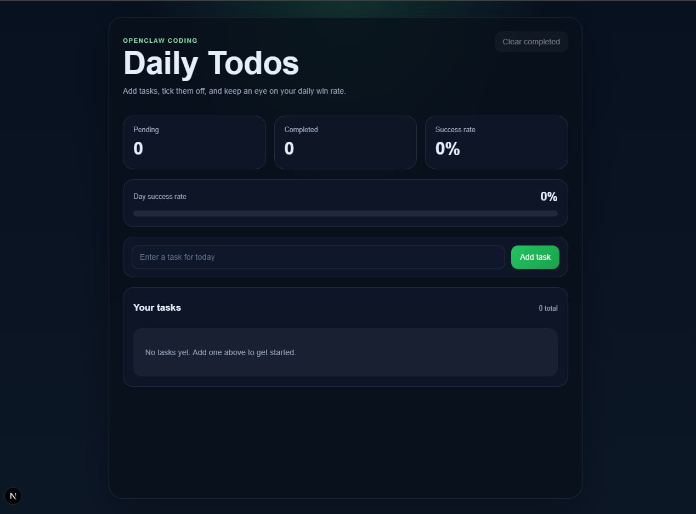

# Daily Todos

A simple Next.js app for tracking your daily tasks, checking off completed items, and measuring your day success rate.



## Features

- Add tasks for the day
- Mark tasks as done or pending
- View pending task count
- View completed task count
- See your daily success rate as a percentage
- Saves tasks in local storage

## Tech Stack

- Next.js
- React
- TypeScript
- CSS Modules

## Run Locally

```bash
npm install
npm run dev
```

Then open `http://localhost:3000`.

## Project Structure

```text
src/app/page.tsx          # main Daily Todos UI and logic
src/app/page.module.css   # component styling
src/app/globals.css       # global styles
public/daily-todos-preview.jpg
```
